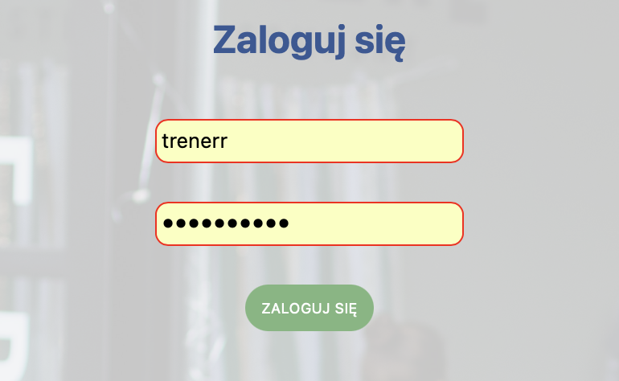
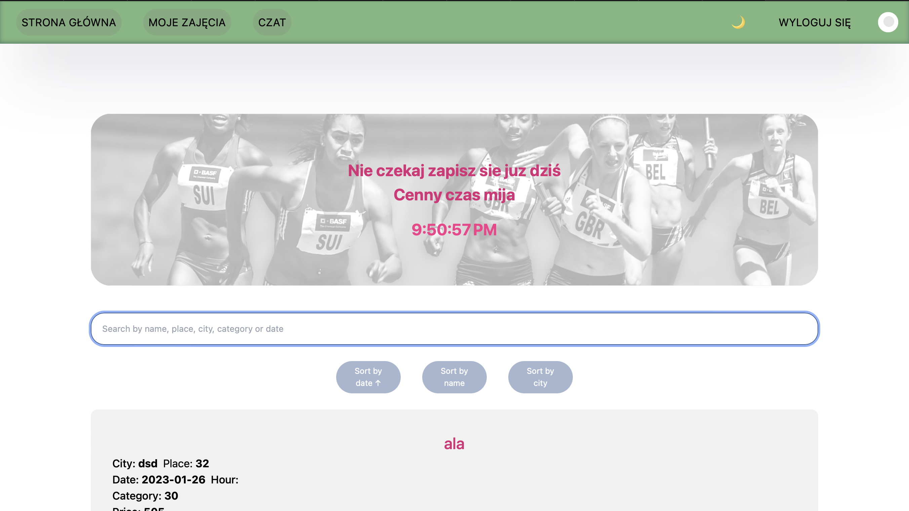
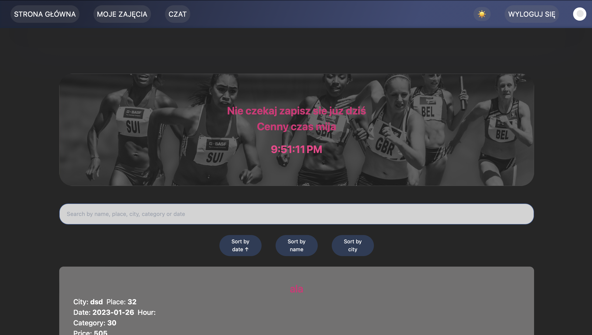
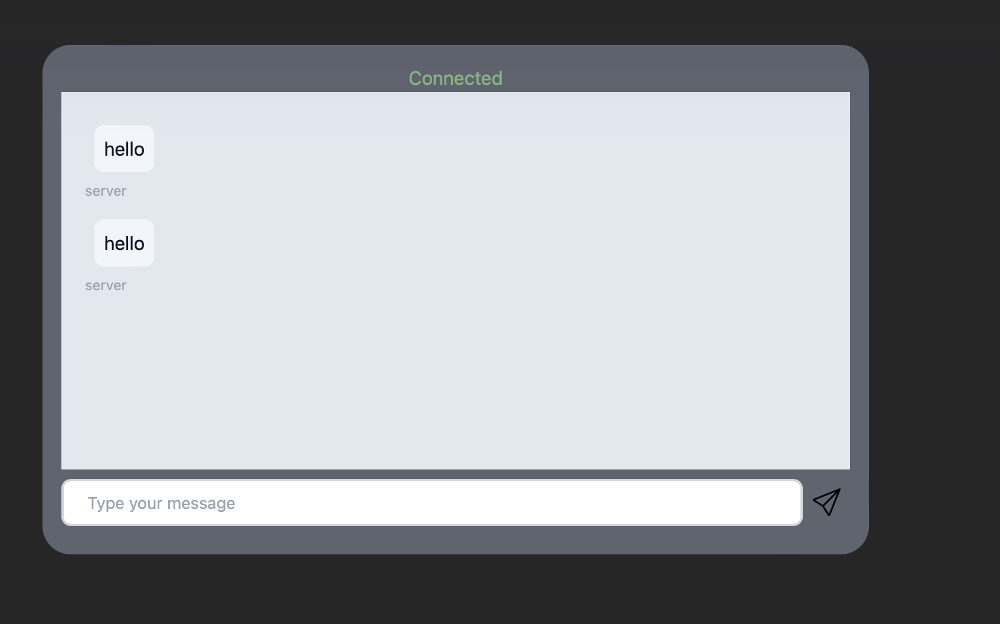
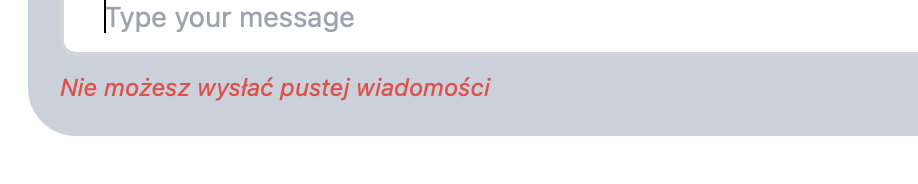

# Project for University classes

Magdalena Makaro

## Project description

Aplikacja do zarządzania zajęciami sportowymi. Umożliwia tworzenie, edycję i usuwanie zajęć jako nauczyciel. Pozwala również uczestnikom zapisać się na wybrane zajęcia, zobaczyc liczbe zapisanych uczestników oraz zostawić komentarz pod zajęciami, co nie jest dostępne dla roli nauczyciela. Zarówno dla nauczycieli, jak i studentów możliwe jest przeglądanie listy zajęć i ich szczegółów oraz tworzenie nowego konta. Aplikacja posiada równie panel

## Page views

### Login page view

### Wrong user,password in login page view

### User main page view

##### Light mode

##### Dark mode

### Chat view

## Skills i developed in this project

Frontend:

- tailwindcss
- scss
- react
- redux

Backend:

- node.js
- express
- neo4j
- jwt

Protocols:

- http
- mqtt
